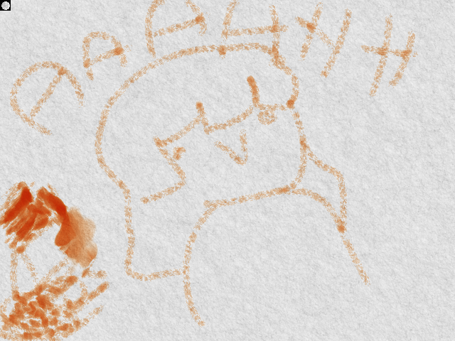

# Crayon Simulation

crayon simulation based on [this paper](https://www.researchgate.net/publication/4038539_Simulating_wax_crayons)

## controls

C clears canvas

number keys 1 thru 0 change crayons (different colors)

in the qt version, keys to change size/reinit the current crayon tip are (L)arge, (M)edium, and (S)mall
